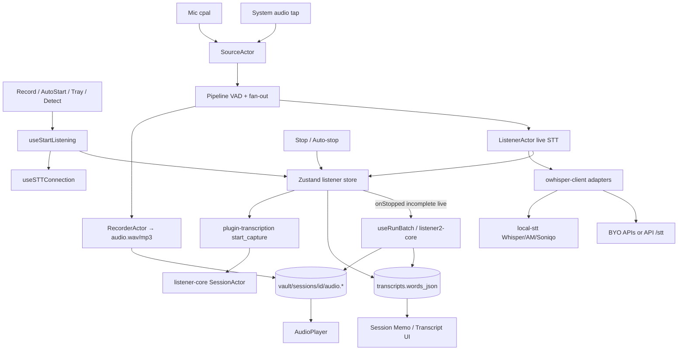

# Product Requirements Document (PRD)

**Product:** Meeki (this repository; historically Hyprnote; forkable as Meeki)  
**License:** MIT  
**Status:** Living reference of *current* product behavior and architecture  
**Last updated:** 2026-07-26  
**Sources:** `README.md`, `AGENTS.md`, `docs/`, `apps/*`, `packages/*`, `plugins/*`, `crates/*`, `supabase/`

This document describes what the app does today and how it is built, so future edits have a shared baseline. It is not a redesign proposal.

---

## 1. Product overview

### 1.1 Positioning

Meeki is an **open-source, local-first AI meeting notetaker**. It records meetings without joining as a bot (mic + system audio), transcribes (on-device and/or cloud/BYOK), stores canonical data in **local SQLite**, and supports editable memos, AI summaries, transcripts, calendar linkage, contacts, templates, chat, CLI/MCP, and optional cloud features (auth, hosted AI, CloudSync, sharing).

Tagline framing in README: *“Granola, rearranged.”*

### 1.2 Core user loop

1. Open or create a meeting **session** (manual, calendar, tray, or meeting detection).
2. **Record** (start/stop anytime; optional auto-start/stop helpers).
3. Capture **mic + system audio**; write audio under the session vault path.
4. **Transcribe** live and/or batch after stop.
5. Edit **Memo** / review **Transcript** / generate **Summary** (Intelligence / templates).
6. Optionally export (Markdown, PDF, text, Org), chat with the meeting, share, or sync.

### 1.3 Product principles

| Principle | Behavior today |
|-----------|----------------|
| Local-first | Sessions, notes, transcripts live in local SQLite; audio/attachments are local files by default |
| Privacy-first | On-device STT and BYOK LLM keep data off Meeki servers when configured that way |
| Optional cloud | Auth, hosted STT/LLM, CloudSync, Google/Outlook, sharing are opt-in |
| Sessions as hub | All notes are backed by sessions (`AGENTS.md`) |
| Forkable | MIT; package/crate names still use `@meeki/*` / `meeki-*` historically |

### 1.4 Name / branding history

Hyprnote → brief “char” naming → split: **[char](https://char.com)** is the team’s current commercial productivity app; **this repo** remains the OSS meeting notetaker (meeki). Docs: https://docs.meeki.ai

---

## 2. Feature requirements (current)

### 2.1 Free / local capabilities

From product docs and `packages/pricing/src/tiers.ts`:

- On-device transcription (supported platforms; Apple Silicon emphasized for local models)
- Save audio recordings + audio player
- Bring-your-own-key STT and LLM (and OpenAI-compatible / Ollama / LM Studio)
- Export (Markdown, PDF, text, Org; memo / summary / transcript combinations)
- Custom default folder / vault location
- In-app chat over meetings
- Contacts view (humans / organizations)
- Calendar view (Apple Calendar without Pro)
- Templates for summaries
- CLI + MCP (read-only against local `app.db`)
- Manual **Record / Stop / Resume** without requiring Zoom/Teams detection
- Import audio (WAV/MP3/…) and SRT/VTT transcripts
- Dictionary / languages for STT
- Floating meeting bar, tray “start meeting”, keyboard shortcuts
- Audio retention policies (`forever` … `none`)

### 2.2 Pro / paid capabilities (JWT entitlements)

Entitlement keys: `hyprnote_pro`, `hyprnote_lite` (Lite counts as paid for many STT/LLM/integration gates; Pro-only for CloudSync / some share / E2EE APIs).

- Hosted (Meeki) cloud transcription — **the hosted cloud LLM provider was removed from the desktop app** (§2.6)
- Local ↔ cloud sync (E2EE CloudSync)
- Google Calendar / Outlook Calendar (via Nango + API)
- Shareable links / invites / public slugs (partial DocSend-like features)
- Speaker identification (partial; Pyannote routes)
- Higher rate limits on `/stt` and `/llm`
- Playback rate controls gated Pro in desktop UI
- Trial path (configured in `packages/pricing`; Stripe-backed)

**Meeki fork note:** Comp / admin Pro without Stripe is supported via `private.pro_grants` (Supabase auth hook) and client env `VITE_FORCE_PRO` / `VITE_PRO_GRANT_EMAILS`. Stripe remains for charging other users later. Cloud Pro features still require *your* API + Supabase, not upstream Meeki servers.

### 2.3 Meetings & recording

| Requirement | Current behavior |
|-------------|------------------|
| Freeform record | Header **Record / Stop / Resume**; ⌘⇧N / tray / empty-state start |
| Join & record | When session has meeting URL (Zoom/Meet/Teams/…): open link + start |
| Auto-start scheduled | Setting `auto_start_scheduled_meetings` + calendar countdown |
| Mic detection | Setting `notification_detect`: “Are you in a meeting?” → confirm → auto-start |
| Auto-stop | Setting `auto_stop_meetings` when trigger meeting apps release mic |
| Dual audio | Microphone + system audio (speaker tap) |
| Live + batch STT | Live during capture when model supports it; batch repair on stop if needed |
| Consent / chat | Optional meeting-chat capture and Slack disclosure strings |

### 2.4 Notes surface

Each session exposes:

- **Memo** — user notes (TipTap / ProseMirror via `@meeki/editor`)
- **Summary** — AI-enhanced / template output (`session_documents` kinds)
- **Transcript** — word-level JSON + speaker hints
- Title, participants, tags, action items, attachments
- Enhance / regenerate summary flows (`apps/desktop/src/services/`, chat tools)

### 2.5 Calendar

- **Apple Calendar** — local EventKit (macOS); no cloud account required
- **Google / Outlook** — Pro; OAuth via Nango; events cached in local SQLite
- Used for titles, times, participants, meeting links, notifications, auto-start

### 2.6 AI (Intelligence)

Powers summaries, titles, and chat. Templates + Auto prompt customize summaries (`docs/customize-summaries.mdx`).

**Providers** (`apps/desktop/src/settings/ai/llm/shared.tsx`), in sort order:

`on_device` (bundled llama.cpp), `venice`, `lmstudio`, `ollama`, `openrouter`, `openai`,
`cloudflare_workers_ai`, `anthropic`, `mistral`, `azure_openai`, `azure_ai`,
`google_generative_ai`, `custom`.

The hosted **`hyprnote` / "Meeki Pro" LLM provider was removed.** Its auth + entitlement
gate, the "Upgrade to Pro" redirect on provider select, and the "Pro (Cloud)" model label are
gone. Installs still pointing at it are cleared on launch (`apps/desktop/src/auth/billing.tsx`,
`RETIRED_HOSTED_LLM_PROVIDER`). Note the id `hyprnote` still exists on the **STT** side, where
it means *on-device Soniqo* — see §2.7.

**On device** is the default path; see §3.6 for the runtime and §5.5 for the pipeline.

### 2.7 Transcription (STT)

- Local: Soniqo (Parakeet / Qwen3 ASR), Whisper quantized, AM models via `plugins/local-stt`.
  Provider id is `hyprnote`, displayed as **"On device"** — this is *not* the removed cloud LLM provider.
- Live capture always uses `soniqo-parakeet-streaming` (preview only, never persisted); the saved
  transcript comes from a batch pass with `soniqo-qwen3-large` by default.
- Hosted Meeki cloud STT (`{VITE_API_URL}/stt`, model id `cloud`) still exists in code but is
  hidden from the picker.
- BYO: Deepgram, AssemblyAI, OpenAI, Cartesia, Gladia, Soniox, ElevenLabs, Mistral, Fireworks, Pyannote, Aquavoice, custom, etc. (`settings/ai/stt/shared.tsx`)

### 2.8 Sharing & sync

- Session sharing: private access, link tokens, invites, public slug (`s_…`)
- Web viewers under `/share/*`
- Attachment backups / shared attachments (Pro API)
- CloudSync: E2EE records projection; protocol modes `e2ee_enforced` | `e2ee_only` | `dual`

### 2.9 Integrations (paid API)

- Calendar list/events (Google/Outlook)
- Gmail-style mail routes
- GitHub / Linear tickets
- Nango connection management
- Research search + MCP nest
- Pyannote diarize / identify / voiceprint
- Todos: GitHub + Apple Reminders (desktop settings)

### 2.10 Agent / CLI surfaces

- `meeki` CLI: list/get/note/transcript/history/export meetings; `doctor`; `mcp`
- MCP tools: `list_meetings`, `get_meeting`, `get_meeting_transcript`, `get_recurring_meeting_history`
- Desktop Settings → Developers → install CLI to `~/.local/bin/meeki`

### 2.11 Non-goals / out of scope for “core local”

- Replacing the commercial char.com product
- Requiring Supabase to open the desktop app or edit local notes
- Bot joining Zoom/Meet as a participant (product is bot-free capture)

---

## 3. Technical architecture

### 3.1 Monorepo layout

```
apps/
  desktop/     # Primary product — Tauri 2 + React (Vite)
  web/         # Marketing, auth/billing UI, share viewers, admin APIs
  api/         # Axum backend (proxies, sync, billing, integrations)
  cli/         # meeki CLI + MCP
  stripe/      # Stripe ↔ Supabase sync worker
packages/      # Shared TS (@meeki/db, editor, ui, supabase, pricing, …)
plugins/       # Tauri plugins (Rust + JS bindings)
crates/        # Rust domain (db-app, audio, STT, sync, API modules, …)
supabase/      # Cloud Postgres migrations + RLS tests
docs/          # User docs (Mintlify → docs.meeki.ai)
legacy/        # Importers / legacy parsers
```

**Workspaces:** `pnpm-workspace.yaml` (`apps/*`, `packages/*`, `plugins/*`, …); Cargo workspace in root `Cargo.toml` (`apps/api`, `apps/cli`, `apps/desktop/src-tauri`, `crates/*`, `plugins/*`).

**Tooling:** Node ≥ 22, pnpm, Turbo, dprint/oxfmt, Rust toolchain (`rust-toolchain.toml`), Taskfile for Supabase helpers.

### 3.2 High-level system diagram

```text
┌─────────────────────────────────────────────────────────────────┐
│ Desktop (Tauri + React)                                         │
│  UI: sessions, STT, calendar, settings, chat, sharing           │
│  State: Zustand tabs/listener · TanStack Query · TipTap editor  │
└───────────────┬─────────────────────────────┬───────────────────┘
                │                             │
                ▼                             ▼ optional HTTPS
     Local SQLite (app.db)              apps/api (Axum)
     + vault files (audio, …)             ├── /stt /llm
     via plugins/db + crates/db-app       ├── /sync (E2EE, shares)
                                          ├── /subscription|/billing|/rpc
                                          ├── /calendar /mail /ticket /nango
                                          └── research / pyannote / support
                │                             │
                │                             ▼
                │                      Supabase Auth + Postgres
                │                      Stripe · Nango · SQLite Cloud
                ▼
     CLI / MCP (read-only same DB)

Web: marketing · account/checkout · share viewers · ops admin APIs
```

### 3.3 Desktop stack

| Layer | Choice |
|-------|--------|
| Shell | Tauri 2 (`apps/desktop/src-tauri`) |
| UI | React 19, Vite, TanStack Router / Query / Form |
| Editor | `@meeki/editor` (ProseMirror); styles in `@meeki/tiptap` |
| Styling | Tailwind + `@meeki/ui`; `cn` from `@meeki/utils`; `motion/react` |
| i18n | Lingui |
| DB access | Drizzle schema mirror (`packages/db`) + `useDrizzleLiveQuery` (`packages/db-react`) over `@meeki/plugin-db` |
| Schema SoT | Rust SQL migrations in `crates/db-app/migrations/` |

### 3.4 Data stores

| Store | Role |
|-------|------|
| **SQLite `app.db`** | Canonical durable domain (sessions, documents, transcripts, …) |
| **Vault filesystem** | `sessions/{id}/audio.{mp3,wav,ogg}`, attachments |
| **Tantivy** | Full-text search index (`plugins/tantivy` + dirty-queue migrations) |
| **Zustand** | Ephemeral UI: tabs, live listener/transcript |
| **Supabase Postgres** | Auth users, profiles, Stripe mirrors, share metadata, RLS |
| **SQLite Cloud** | CloudSync encrypted replica (via API token exchange) |
| **TinyBase** | Legacy only; not active runtime SoT |

### 3.5 Local-first vs cloud split

| Local (default) | Cloud / networked |
|-----------------|-------------------|
| SQLite + vault files | Supabase Auth + JWT claims |
| On-device STT / local LLM / BYOK | Hosted `/stt`, `/llm` |
| Apple Calendar | Google/Outlook via Nango |
| Offline edit + local models if preconfigured | CloudSync, share links, attachment backups |

Desktop constructs `supabase: null` when `VITE_SUPABASE_URL` / `VITE_SUPABASE_ANON_KEY` are absent (`apps/desktop/src/auth/client.ts`).

### 3.6 On-device LLM runtime

The app ships a **bundled llama.cpp** so local interpretation needs no second install.
Weights are never bundled — they download from Hugging Face on demand.

| Concern | Detail |
|---------|--------|
| Runtime | `llama-server` + dylibs (~50 MB) at `Contents/Resources/llama-cpp/` |
| Fetched by | `apps/desktop/src-tauri/scripts/prepare-llama-cpp.mjs` (release `b10067`, macOS arm64; override `MEEKI_LLAMA_CPP_RELEASE`) |
| Wired via | `tauri.conf.json` → `"resources/llama-cpp": "llama-cpp"`; `pnpm llama:prepare` runs before every app build |
| Catalog | `crates/local-model/src/lib.rs` (`GgufLlmModel`) |
| Selectable set | `crates/local-llm-core/src/model.rs` (`SUPPORTED_MODELS`, aarch64 only) |
| Process control | `plugins/local-llm/src/ext.rs` — `start_server` / `stop_server` / `server_url` / `recommended_model` |
| Weights path | `{settings.global_base}/models/llm/<file>.gguf` |

**Model catalog and memory tiers.** `recommended_model_for_memory()` reads total RAM
(`sysinfo`) and picks a model that fits inside Metal's ~75% working-set budget with ~2 GB
spare for KV cache. Gemma leads open models on summarization faithfulness, which is the
job here, so it takes the tiers that can hold it.

| Total RAM | Recommended | Size | Min RAM | Notes |
|-----------|-------------|------|---------|-------|
| ≥ 22 GiB | `gemma-4-26b-a4b` | 13.6 GB | 24 GB | MoE, 3.8B active |
| ≥ 12 GiB | `gemma-4-12b` | 7.1 GB | 16 GB | dense |
| below | `qwen3-4b` | 2.5 GB | 8 GB | dense |

Also selectable but never recommended: `qwen3.6-35b-a3b` (17.7 GB, min 32 GB) and
`qwen3.6-35b-a3b-q4km` (22.1 GB, min 36 GB), kept for tool-heavy chat — the Qwen 3.5/3.6
line trades summarization faithfulness for agentic skill. The two are the **same weights at
different quantizations** (Unsloth Dynamic IQ4_XS vs Q4_K_M); the Q4_K_M file is 4.4 GB
larger for a small fidelity gain and only fits comfortably on 36 GB+ Macs. Users download
them from the **Other local models** expander (`settings/ai/llm/other-models.tsx`); the
model dropdown only lists weights already on disk.

**Per-model facts in the UI.** `GgufLlmModel` carries `description()` (plain-language
strengths, no sizes), `min_memory_bytes()` (the Mac tier a model realistically needs) and
`warmup_seconds()`; all three ride on `ModelInfo` to TypeScript. `ModelFacts`
(`settings/ai/shared/model-facts.tsx`) renders strengths + download size + RAM need in the
on-device setup card, the on-device card, and the Other-local-models expander, and warns in
amber when a model exceeds this Mac's memory. `never_recommends_a_model_the_mac_cannot_hold`
keeps `min_memory_bytes()` and `recommended_model_for_memory()` from drifting apart.

**Server flags** (`crates/local-llm-core/src/server.rs`):

```
--model <path> --host 127.0.0.1 --port <free>
--ctx-size <adaptive>       # grows to fit a long transcript; MEEKI_LLM_CTX_SIZE overrides, clamped 8192–262144
--parallel 1                # one slot; each slot gets its own sliding-window KV cache
--reasoning-format deepseek # thoughts land in reasoning_content, never in the note
--reasoning-budget -1       # MEEKI_LLM_THINK_BUDGET
--chat-template-kwargs {"enable_thinking":false}
--sleep-idle-seconds 300    # MEEKI_LLM_SLEEP_IDLE_SECONDS
--alias <openai_model_id> -ngl 99
```

The KV cache is allocated up front, so `--ctx-size` costs memory whether or not a
conversation fills it — and the per-token cost varies by an order of magnitude across the
catalog, so the window is derived from detected RAM and the model rather than fixed. Read off
the shipped GGUFs: Gemma 4 12B costs 16 KiB/token (only 8 of its 48 layers use full attention,
at 1 KV head × 512 head dim) plus a fixed 480 MiB for the 40 sliding-window layers, while the
much smaller Qwen 3 4B costs 144 KiB/token because all 36 of its layers keep 8 KV heads and it
has no sliding window. A fixed 64k therefore reserved 9 GiB of KV for Qwen 3 4B on the 8 GiB
Macs it is recommended to, and 20 GiB for Llama 3.3 70B.

**Idle sleep.** After 300 s without a request llama-server unloads the weights and drops to
~80 MB RSS; the next request reloads them. Measured on an M4 / 16 GB Mac against b10067 with
`gemma-4-12b` (7.1 GB): RSS 9,285 MB → 81 MB asleep, reload ~3.0 s with the file in the page
cache and ~4.8 s once evicted (≈4.0 s and ≈6.2 s end-to-end including the completion).
`warmup_seconds()` models this as `1 + size / 1.5 GB/s`. llama-server **rejects
`--sleep-idle-seconds 0`** and exits at startup, so `parse_sleep_idle_seconds` maps any
value ≤ 0 to `-1` (disabled) and floors positive values at 30 s to avoid reload thrash.

**Lifecycle.** `start_server` is idempotent — it reuses a live server already serving the
same model, otherwise replaces it, and starts outside the state lock so a slow load doesn't
block downloads or status polls. `server_url` prunes crashed processes.
`useEnsureLocalLlm` (mounted in `main/lifecycle.tsx`) polls every 5 s while `on_device` is
selected, keeps the server up, and writes the live `base_url` into provider storage only
when it changes. `syncLocalLlmServer` in `settings/queries.ts` stops the server when the
user switches away.

The 5 s poll does **not** defeat idle sleep: `start_server`'s reuse path only calls
`child.try_wait()`, a process check with no HTTP traffic. `/health`, `/props` and
`/v1/models` also answer without waking a sleeping server — but `/slots` and `/metrics`
**do** wake it, so neither may be used for status polling.

**Warm-up indicator.** Because a sleeping server's process is still alive, `start_server`
returns instantly and the whole reload lands inside an ordinary HTTP request — a latency
class that did not exist before. There is no non-waking endpoint that reports it
(`/health` stays `{"status":"ok"}` through a wake; its 503 `"Loading model"` only covers the
initial process start), so it is observed at the transport instead: `createWarmupFetch`
(`ai/local-llm-warmup.ts`) wraps the `on_device` fetch in `useLLMConnection.ts` and flags a
warm-up when headers take longer than 900 ms. `ModelWarmingUp`
(`shared/ui/model-warming-up.tsx`) renders a countdown against `warmup_seconds()` in the
enhance streaming view and the chat loading bubble, capping at 95 % and switching to an
indeterminate pulse on overrun rather than stalling at 100 %. `tasks.ts` adds the remaining
warm-up estimate to `TASK_STREAM_START_TIMEOUT_MS` so a reload is not mistaken for a stall.

---

## 4. Domain model

**Rule:** Sessions are the core entity; notes/transcripts/attachments hang off sessions.

Canonical migration: `crates/db-app/migrations/20260710223922_canonical_data_model.sql`.

| Table | Purpose |
|-------|---------|
| `sessions` | Meeting/note container (`kind` default `meeting`, event linkage, folder, slug, status, times) |
| `session_documents` | Rich docs: `note`, `summary`, `template_output`, legacy kinds |
| `transcripts` | `words_json`, `speaker_hints_json`, provider/model, audio link |
| `session_participants` | Attendees → `humans` |
| `session_attachments` | Recordings and files (`source_type` includes `session_audio`) |
| `action_items` | Todos from meetings |
| `humans` / `organizations` | Contacts CRM-lite |
| `tags` / `session_tags` | Labeling |
| `entity_mentions` | Cross-entity refs |
| `chat_groups` / `chat_messages` | In-app AI chat |
| `daily_notes` | Non-meeting daily notes |
| `templates` | Summary templates |
| `calendars` / `events` | Local calendar cache |
| `workspaces` / `workspace_memberships` | Multi-device / CloudSync tenancy |
| `app_settings` | Key/value JSON settings |

**E2EE domain tables** (encrypted sync projection): `sessions`, `session_documents`, `transcripts`, `session_participants`, `session_attachments`, `action_items`, `humans`, `organizations` (`crates/db-app/src/e2ee.rs`).

**CloudSync registry:** many tables listed in `crates/db-app/src/cloudsync.rs`; direct enabled sync is centered on `e2ee_records` with plaintext domain tables projected through E2EE.

Supporting tables (later migrations): E2EE local state/dirty/witness, share caches, attachment transfer jobs, search index dirty/state, etc.

---

## 5. Data flow

### 5.1 Session / note read-write path

```text
UI component
  → useDrizzleLiveQuery / mutations (@meeki/db-react + Drizzle)
  → @meeki/plugin-db execute/subscribe
  → crates/db-* + migrations (db-app)
  → app.db
```

Schema ownership stays on the Rust migration side; TypeScript schema is a typed mirror (`packages/db/AGENTS.md`).

### 5.2 Audio & transcription pipeline



**Narrative:**

1. Start binds to `session_id`, acquires capture lifecycle/CloudSync lease as needed, resolves STT connection.
2. Rust opens **mic + speaker** (`crates/audio-actual`), records under `sessions/{id}/`, optionally streams live STT.
3. Live deltas update Zustand (captions/UI) and SQLite `transcripts`.
4. On stop, finalize `audio.mp3`. If live was incomplete/unavailable → **batch STT** then enhance; else enhance-only.
5. Retention policy may delete audio after transcript is processed (`audio_retention` / `save_recordings`).

**Key paths:**

- UI orchestration: `apps/desktop/src/stt/useStartListening.ts`, `useRunBatch.ts`, `useSTTConnection.ts`, `contexts.tsx`
- Plugin: `plugins/transcription`, `plugins/local-stt`, `plugins/detect`, `plugins/fs-sync`
- Rust: `crates/listener-core`, `crates/listener2-core`, `crates/audio-actual`, `crates/owhisper-client`, `crates/detect`

**Importing an existing audio file.** `AUDIO_EXTENSIONS` (`stt/useUploadFile.ts`) is the single
source for the file-picker filters in both entry points and for the drop-overlay copy. Decoding
is `meeki_audio_norm::normalize_file` → `rodio::Decoder::try_from(File)` with **no format hint**,
so symphonia sniffs the content and the extension lists are advisory only; everything is
re-encoded to a 16 kHz `audio.mp3`.

| Format | Decodes | Note |
|--------|---------|------|
| wav, mp3, ogg (Vorbis), mp4, m4a, flac, aac, aiff, caf | yes | each covered by a `test_import_*` case in `crates/audio-norm/src/lib.rs` |
| webm | yes (macOS) | Opus is lifted out of the Matroska container into Ogg (`crates/audio-norm/src/webm_opus.rs`) and then decoded by `afconvert`; symphonia has no Opus decoder and CoreAudio cannot open Matroska, so neither works alone |
| opus | macOS only | falls through to the `afconvert` shim (`crates/afconvert`); fails on other platforms |

Drop and paste are wider than the picker: `isAudioUploadFile` also accepts `.qta` and any
`audio/*` MIME, and `allowUnknownAudio` bypasses the check entirely, so unsupported containers
surface as raw decoder errors through `handleBatchFailed`.

Audio drop targets are wired in the raw note editor, the enhanced note editor, and the transcript
tab (`session/components/note-input/audio-drop-target.tsx`). Other surfaces — sidebar, empty tab,
chat — ignore dropped files. Because the Soniqo bridge downloads its weights lazily on first use,
`warnIfSttPackMissing` toasts before the first import so a ~2 GB fetch doesn't look like a hang.

### 5.2b Summarization (enhance) pipeline

```text
transform  → load session, transcripts, template, participants, images
prompt     → crates/template-app renders enhance.system + enhance.user (Jinja/Askama)
stream     → streamText(temperature 0.2, topP 0.9, maxOutputTokens 32768, maxRetries 4)
validate   → first 10–30 chars must match the template's first section (≤2 retries)
transforms → normalizeBulletPoints → smoothStream(250 ms, line)
consume    → tasks.ts: text-delta → streamedText, reasoning-delta → streamedReasoning
persist    → enhance-success.ts → session_documents.body (ProseMirror JSON)
```

Key behaviors worth preserving:

- **Sampling is explicit.** Left unset, llama.cpp samples at `temperature 0.8`, which invents
  detail on the one task where faithfulness matters. `groundedGenerationSettings()` pins
  summaries to `0.2 / topP 0.9`. Short structured tasks use `deterministicGenerationSettings()`
  (temperature 0).
- **Thinking mode is opt-in** via the `llm_thinking` setting (default `false`,
  `settings/ai/llm/thinking-toggle.tsx`). The server disables thinking globally; enhance
  re-enables it per request through `thinkingProviderOptions()`. This scoping is load-bearing:
  title generation caps output at 128 tokens and chat titles at 32, so a reasoning model would
  spend the whole budget thinking and return nothing.
- **Reasoning is displayed, never stored.** `streamedReasoning` feeds an expandable
  disclosure above the streaming summary (`enhanced/thinking.tsx`); only the final markdown is
  persisted.
- **Length scales with the meeting.** `services/enhancer/summary-length.ts` guides the model
  to ≤ 16,000 characters and ≤ 12 sections, proportional to transcript length.
- **Action items have explicit rules** in `enhance.system.md.jinja`: only explicit commitments,
  owner taken from the transcript speaker, no inferred deadlines, no invented owners.

### 5.3 Auth & billing claim flow

```text
Stripe entitlements → stripe.active_entitlements
  → public.custom_access_token_hook
       (+ private.pro_grants email allowlist)
  → JWT claims: entitlements, subscription_status, trial_end, …
  → Desktop deriveBillingInfo / API Claims::is_pro|is_paid
  → UI gates + API middleware + Supabase RLS
```

### 5.4 CloudSync (simplified)

```text
Desktop enable Sync (Pro)
  → POST /sync/token
  → SQLite Cloud credentials
  → plugins/db CloudSync + E2EE encrypt/decrypt domain rows
  → e2ee_records / witness APIs
```

---

## 6. Desktop component & module structure

### 6.1 Routes (`apps/desktop/src/routes/`)

| Path | Role |
|------|------|
| `/app` | Shell; listener store |
| `/app/main` | Main window layout (tabs live here) |
| `/app/note/$sessionId` | Session deep link |
| `/app/onboarding` | First-run wizard |
| `/app/composer` | Composer surface |
| `/app/instruction` | Deep-link / integration handoff |

Most UX is **tab-based** inside the main shell (`store/zustand/tabs`), not many file routes.

### 6.2 Tab types

`sessions`, `shared_sessions`, `shared_note_preview`, `contacts`, `templates`, `humans`, `organizations`, `empty`, `calendar`, `changelog`, `settings`, `onboarding`, `edit`, `task`, `daily_summary`

### 6.3 Major modules under `apps/desktop/src/`

| Module | Responsibility |
|--------|----------------|
| `session/` | Meeting note UI: header, memo, summary, transcript, export, enhance |
| `stt/` | Listening lifecycle, connections, batch, recovery, keywords |
| `chat/` | AI chat panel, tools, MCP-related surfaces |
| `sidebar/` | Timeline, nav to calendar/contacts/templates/settings/shared |
| `calendar/` | Calendar views + queries |
| `contacts/` | Humans / orgs |
| `templates/` | Summary templates editor |
| `settings/` | App, account, sync, notifications, permissions, AI STT/LLM, dictionary, todo, developers |
| `onboarding/` | Permissions, login, calendar, final, welcome note |
| `auth/` | Supabase client, billing provider, CloudSync preference, deeplink |
| `billing/` | Trial dialogs |
| `session-sharing/` | Share create/sync/comments/attachments |
| `shared-notes/` | Inbound shared note preview / handoff |
| `attachment-sync/` | Cloud attachment transfer lifecycle |
| `audio-player/` | WaveSurfer playback |
| `meeting-float/` | Compact bar while listening |
| `ai/` | LLM connection helpers |
| `search/` | Search UI |
| `services/` | Event listeners, enhancer, audio retention |
| `task/` | GitHub issue/PR tabs |
| `db/` | Desktop DB wiring |
| `store/zustand/` | Tabs, listener, transcript, … |
| `editor-bridge/` | App ↔ editor bridge |

### 6.4 Settings sections

`app` (general/meetings/telemetry/storage), `account`, `sync`, `notifications`, `permissions`, `developers`, `dictionary`, `transcription`, `intelligence`, `todo` (+ nav opens Calendar / Contacts / Templates).

### 6.5 Onboarding (macOS)

`permissions` → `login` → `calendar` → `final` (other platforms skip permissions step as configured).

### 6.6 Editor packages

- `packages/editor` — ProseMirror note editor, plugins (autolink, clipboard, comments, hashtags, tasks, search, …)
- `packages/tiptap` — shared editor CSS
- `packages/ui`, `packages/utils` — shared UI / `cn`

### 6.7 Tauri plugins (registered in `apps/desktop/src-tauri/src/lib.rs`)

Notable: `db` (+ CloudSync), `auth`, `calendar`, `transcription`, `local-stt`, `local-llm`, `detect`, `tray`, `windows`, `fs-sync`, `fs2`, `tantivy`, `export`, `importer`, `template`, `attachment-sync`, `mcp`, `agent`, `updater2`, `analytics`, `notification`, `shortcut`, `dictation`, `permissions`, `settings`, `overlay`, `opener2`, `deeplink2`, …

Capabilities: `apps/desktop/src-tauri/capabilities/default.json` (broad plugin defaults; HTTP allow includes `https://**` / `http://**`).

---

## 7. Web app structure

**Stack:** Next.js 16 App Router, built by `vinext`, deployed to a Cloudflare
Worker (`apps/web`). This is what serves meeki.ai.

> The table below previously described a TanStack Start app with auth, billing,
> share-viewer and admin-CMS routes. That tree was **never deployed** — every
> route in it returned 404 on meeki.ai and `meeki.org` has no DNS record — and it
> was removed in `852ee6c`. It is recoverable from history if any of it is worth
> porting. See DEPLOYMENT.md § 2 for the routes the Rust backend still generates
> links into but which no longer exist.

### 7.1 User-facing routes

| Route | Feature |
|-------|---------|
| `/` | Marketing landing page (private-notekeeper framing) |
| `/personal` | Same landing page, personal framing |
| `/r/[code]` | Referral redirect — sets a cookie, 302s to `/`, `noindex` |

### 7.2 Crawler and metadata routes

| Route | Source |
|-------|--------|
| `/sitemap.xml` | `app/sitemap.ts` |
| `/robots.txt` | `app/robots.ts` — names GPTBot, ClaudeBot, OAI-SearchBot, PerplexityBot, Google-Extended and others explicitly as allowed |
| `/llms.txt` | `app/llms.txt/route.ts`, content in `content.txt` |
| `/manifest.json`, `/favicon.ico`, icons | `public/` |

JSON-LD (`SoftwareApplication`, `Organization`, `WebSite`) is emitted from
`app/site.ts` via the root layout. `SITE_ORIGIN` there is the single source for
every absolute URL.

There are **no** web API routes. The app has no database, no auth and no
workspace dependencies.

### 7.3 Unpublished content

`apps/web/content/` holds 62 salvaged articles and two legal documents that
**no route serves**. Read `apps/web/content/README.md` before publishing any of
them — 61 of the 62 are still live on char.com under a different author, and all
273 of their images are gone.

---

## 8. API endpoints (`apps/api`)

**Framework:** Axum  
**Auth:** Supabase JWT Bearer (`crates/api-auth`)  
**Composition:** `apps/api/src/main.rs`  
**Paid entitlements:** `hyprnote_pro` \| `hyprnote_lite`  
**Pro-only:** `hyprnote_pro` for CloudSync token, E2EE witness, attachment backups, share snapshot publish, etc.

### 8.1 Infra

| Method | Path | Auth |
|--------|------|------|
| GET | `/health` | none |
| GET | `/openapi.json` | none |

### 8.2 STT (`crates/transcribe-proxy`)

Auth: JWT · Rate limit: paid vs free tiers

| Method | Path |
|--------|------|
| GET/POST | `/listen`, `/stt/`, `/stt/listen` |
| GET | `/stt/status/{pipeline_id}` |
| POST | `/stt/callback/{provider}/{id}` (webhook, no JWT) |

### 8.3 LLM (`crates/llm-proxy`)

| Method | Path |
|--------|------|
| POST | `/chat/completions` |
| POST | `/llm/`, `/llm/chat/completions` |

### 8.4 Subscription (mounted at `/subscription`, `/rpc`, `/billing`)

| Method | Path |
|--------|------|
| GET | `…/can-start-trial` |
| POST | `…/start-trial` |
| DELETE | `…/delete-account` |

### 8.5 Sync / CloudSync (`/sync`, Pro unless noted)

| Method | Path | Notes |
|--------|------|-------|
| POST | `/sync/token` | CloudSync credentials |
| PUT | `/sync/e2ee/identity` | Recovery key claim |
| POST/PUT/GET | `/sync/attachment-backups/*` | reserve, upload-grant, finalize, head, download, delete |
| PUT | `/sync/shares/{share_id}/snapshot` | Publish share |
| POST | `/sync/shares/{share_id}/attachments/*` | Shared attachment pipeline |
| GET/POST | `/sync/e2ee/witness/{workspace_id}` | Witness |
| PUT | `/sync/shares/{share_id}/web-edit` | JWT only (not Pro middleware) |

### 8.6 Shared notes (root paths)

**Public (IP rate limit):**  
`GET /shared-notes/public/{slug}`, `POST /shared-notes/link/{share_id}`, handoff + attachment download variants, `POST /shared-notes/handoffs/claim`, …

**Authenticated:**  
`POST /shared-notes/invitations/{invitation_id}/email`,  
`POST /shared-notes/access/{share_id}/attachments/{attachment_id}/download`

### 8.7 Paid integrations (`hyprnote_pro` \| `hyprnote_lite`)

- `POST /calendar/google|outlook/list-calendars|list-events`
- `POST /mail/google/*` (labels, messages, threads, …)
- `POST /ticket/github|linear/*`
- `POST /nango/session`
- `POST /research/search` (+ `/research/mcp`)
- `POST /pyannote/v1/diarize|identify|voiceprint`

### 8.8 Nango management (JWT only)

`GET|DELETE /nango/connections`, `GET /nango/whoami`  
Webhook: `POST /nango/webhook` (no JWT)

### 8.9 Support (optional JWT)

`POST /feedback/submit`, Chatwoot nests under `/support/chatwoot/*`, `/support/mcp`

### 8.10 Crates not currently mounted in `main.rs`

`api-storage`, `api-messenger`, `api-bot`, `api-claw`, `api-agent` exist under `crates/` but are not wired into the live API router today.

---

## 9. CLI & MCP

```text
meeki [--base DIR] [--db-path FILE] [--json] <command>
```

Env: `MEEKI_BASE`, `MEEKI_DB_PATH`.

| Command | Behavior |
|---------|----------|
| `meetings list\|get\|note\|transcript\|history\|export` | Read/export local meetings |
| `doctor` | DB path + schema readiness |
| `mcp` | Read-only MCP over stdio |

Resources: `meeki://meetings/{id}`, `…/transcript`, `meeki://series/{series_id}`.

Docs: `docs/reference/cli.mdx`, `docs/reference/mcp.mdx`.

---

## 10. Configuration & environment

### 10.1 Desktop (`apps/desktop/src/env.ts`)

| Variable | Purpose |
|----------|---------|
| `VITE_APP_URL` | Web app URL (default `http://localhost:3000`) |
| `VITE_API_URL` | API base (default `http://localhost:3001`) |
| `VITE_SUPABASE_URL` / `VITE_SUPABASE_ANON_KEY` | Enable auth client |
| `VITE_PRO_PRODUCT_ID` | Billing product id |
| `VITE_FORCE_PRO` | Client-side unlock all Pro UI |
| `VITE_PRO_GRANT_EMAILS` | Comma-separated emails unlocked client-side |
| `VITE_SENTRY_DSN`, `VITE_POSTHOG_*` | Telemetry (optional) |
| `VITE_APP_VERSION` | Version string |
| `VITE_ASSEMBLYAI_API_KEY` | Preselects AssemblyAI STT when present |
| `VITE_VENICE_API_KEY` / `VITE_VENICE_BASE_URL` / `VITE_VENICE_MODEL` | Preselects Venice LLM; never overrides an `on_device` selection |

Runtime env read by the Rust side (not Vite):

| Variable | Purpose |
|----------|---------|
| `MEEKI_LLM_CTX_SIZE` | Local LLM context window; default derived from total RAM and the model's KV cost (capped at 20480), grown before a summary to fit the transcript up to what the Mac can hold, clamped 8192–262144 |
| `MEEKI_LLM_THINK_BUDGET` | Reasoning token budget; default `-1` (unrestricted) |
| `MEEKI_LLM_SLEEP_IDLE_SECONDS` | Idle seconds before llama-server unloads its weights; default 300, floored at 30, any value ≤ 0 disables sleeping |
| `MEEKI_LLAMA_CPP_RELEASE` | llama.cpp release tag fetched by `llama:prepare` |
| `MEEKI_HYPR_LLM_URL` | Re-enables the legacy HyprLLM download (disabled by default) |

### 10.2 API / sync (selected)

`SUPABASE_*`, `STRIPE_*`, `NANGO_*`, LLM/STT proxy keys, `SQLITECLOUD_*`, `MEEKI_CLOUDSYNC_*`, `POSTHOG_API_KEY`, `SENTRY_DSN`, Loops/Exa/Jina/Pyannote as configured in `apps/api` + `crates/api-env` / `api-sync`.

### 10.3 Local commands (from `AGENTS.md`)

```bash
pnpm install
pnpm -F @meeki/desktop tauri:dev
pnpm -F web dev
cargo run -p api          # needs full env
task supabase-start       # optional local Supabase
pnpm exec dprint fmt
pnpm -F desktop typecheck
cargo check
```

---

## 10.4 Desktop packaging

One lightweight product ships: **Meeki**, built from `tauri.conf.thin.json`.

```bash
pnpm -F @meeki/desktop tauri:build:app
# = llama:prepare → tauri build --config src-tauri/tauri.conf.thin.json
#   → copy-packaging-artifacts.mjs
```

| Config | Product | Bundle id | Purpose |
|--------|---------|-----------|---------|
| `tauri.conf.json` | Meeki Dev | `com.meeki.dev` | base config, dev |
| **`tauri.conf.thin.json`** | **Meeki** | `com.meeki.dev.thin` | **shipping build**, targets `app` + `dmg` |
| `tauri.conf.stable.json` | Meeki | `com.meeki.stable` | updater disabled |
| `tauri.conf.staging.json` | Meeki Staging | `com.meeki.staging` | staging |
| `tauri.conf.bundled-models.json` | Meeki STT | `com.meeki.dev.stt` | archived; STT weights baked in |
| `tauri.conf.macos-intel.json` / `flatpak.json` | — | — | other targets |

`tauri:build:bundled` is deliberately disabled (`exit 1`) — the product downloads weights
rather than bundling them.

**Signing matters more than it looks.** The thin config sets
`bundle.macOS.signingIdentity: "-"`. Without it Tauri leaves the app *linker-signed only*:
the signing identifier is the binary name rather than the bundle id, `Info.plist` is not
bound, and **the entitlements in `Entitlements.plist` are never applied** — which silently
breaks microphone permission, because macOS cannot attribute or persist a TCC grant to such
a bundle. A correct build reports `Identifier=com.meeki.dev.thin`,
`flags=0x10002(adhoc,runtime)`, `Info.plist entries=22`.

Builds are ad-hoc signed and not notarized, so other Macs warn on first open. After
installing over a previously broken build, reset the stale grant:
`tccutil reset All com.meeki.dev.thin`.

Artifacts land in `apps/desktop/src-tauri/target/release/bundle/` and are copied to
`apps/desktop/dist-packaging/app/`. Copy signed bundles with `ditto`, not `cp -R`.
Approximate sizes: `.app` 422 MB, `.dmg` 188 MB.

---

## 11. Packages of record

| Package | Purpose |
|---------|---------|
| `@meeki/db` | Drizzle schema + DB proxy |
| `@meeki/db-react` | Reactive live-query hooks |
| `@meeki/db-tauri` / `db-runtime` | Transport contracts |
| `@meeki/editor` | Note editor |
| `@meeki/tiptap` | Editor CSS |
| `@meeki/ui` / `@meeki/utils` | UI + helpers |
| `@meeki/supabase` | Client, JWT, `deriveBillingInfo`, Pro grant helpers |
| `@meeki/pricing` | Plan tiers / trial policy |
| `@meeki/api-client` | Generated OpenAPI client |
| `@meeki/store` | Settings Zod schema |
| `@meeki/changelog` | Changelog content |
| `@meeki/plugin-sdk` | Plugin TS SDK |
| `@meeki/agent-*` | Agent runtimes |

---

## 12. Privacy, telemetry, and trust boundaries

Meeki fork P0 posture (2026-07-25):

- PostHog analytics **opt-in** (`telemetry_consent` default `false`; analytics plugin disabled until consent)
- Sentry: JS only after consent + `VITE_SENTRY_DSN`; Rust requires `ENABLE_SENTRY=true` + `SENTRY_DSN`
- Stable auto-updater **disabled** (no `desktop2.hyprnote.com`)
- Whisper / common GGUF models download from Hugging Face (not hyprnote S3)
- Argmax/AM packs and HyprLLM downloads disabled unless `MEEKI_AM_*_URL` / `MEEKI_HYPR_LLM_URL` set
- Resource suggestions do not call `meeki.ai` unless `VITE_RESOURCE_SUGGESTIONS_URL` is set
- Web prod `VITE_API_URL` has no upstream default (`api.char.com` removed)
- Desktop upstream links removed (2026-07-26): changelog no longer fetches from
  `raw.githubusercontent.com/fastrepl/char` (this phoned home on every changelog view),
  onboarding Discord/GitHub/X buttons, tray "Report Bug" / "Suggest Feature" (which opened
  `meeki.ai/discord`), `docs.meeki.ai` links in LM Studio / Ollama / CLI / MCP / calendar,
  and `fastrepl/char` issue links. Publisher is now `Meeki`.
- Local LLM weights come from Hugging Face (`unsloth/*`); the runtime comes from the
  `ggml-org/llama.cpp` GitHub release

Still upstream, deliberately: `com.meeki.*` bundle identifiers (they own the data
directory and Keychain entries — renaming loses existing user data), the legacy `hyprnote://`
deep-link scheme, and CI / web / Supabase / Stripe infrastructure.

Still intentional when the user opts in / configures cloud:

- Cloud STT/LLM/CloudSync/share when enabled and authenticated
- BYOK provider APIs the user configures

Hardening notes for forks: broad Tauri HTTP capability, unscoped `write_text_file` in `plugins/fs2`, Deno `eval` plugin exposure if renderer compromised.

---

## 13. User-facing documentation map

Published at https://docs.meeki.ai — sources under `docs/`:

| Doc | Topic |
|-----|-------|
| `index.mdx` / `quickstart.mdx` | Overview + first meeting |
| `meetings.mdx` | Record / join / stop / resume |
| `automatic-capture.mdx` | Auto-start, detect, auto-stop, floating bar |
| `import-recordings.mdx` | Audio + SRT/VTT import |
| `notes.mdx` | Memo / Summary / Transcript / export |
| `customize-summaries.mdx` | Templates + prompts |
| `calendar.mdx` | Apple / Google / Outlook |
| `ai-setup.mdx` | STT vs Intelligence providers |
| `offline.mdx` / `data-and-privacy.mdx` | Local/offline & privacy |
| `reference/cli.mdx` / `mcp.mdx` | Machine interfaces |
| `agents/*` | Agent workflows |

---

## 14. Acceptance criteria (for regressions)

Use these as “current product still works” checks when editing:

1. **Local session CRUD** works with no Supabase env (create note, edit memo, persist across restart).
2. **Manual Record → Stop** produces audio under session vault and a transcript (local or configured STT).
3. **Meeting detection is optional** — recording does not require Zoom/Teams.
4. **Batch repair** runs when live STT fails but audio exists.
5. **Apple Calendar** works without Pro; Google/Outlook require paid JWT + Nango.
6. **Free user** cannot call Pro-only `/sync/token` without entitlement (or `pro_grants` / Stripe).
7. **Admin grant path:** email in `private.pro_grants` or `VITE_FORCE_PRO` unlocks Pro UI; JWT grant required for API Pro routes.
8. **CLI** `meeki meetings list` reads the same `app.db` as the desktop app.
9. **Export** produces Markdown/PDF from memo/summary/transcript as configured.
10. **Schema changes** go through `crates/db-app/migrations/` + Drizzle mirror — never hand-edit production DB files.
11. **On-device LLM one-click** — the settings card offers the model matching this Mac's RAM,
    downloads it with visible progress and a working cancel, then starts the server and selects
    `on_device` without further input.
12. **Local server survives a restart** — with `on_device` selected, quitting and reopening the
    app leaves a working summary path (no stale `base_url`, no orphaned process).
13. **Thinking mode is off by default**; enabling it shows an expandable thinking section during
    summary generation and still produces a complete summary (title generation must keep working).
14. **Signed bundle** — a fresh `tauri:build:app` produces a bundle whose `codesign -dv` reports
    the real bundle id with `Info.plist` bound and the audio-input entitlement present.
15. **No upstream phone-home** — opening the changelog, onboarding, or tray menus issues no
    requests to `meeki.ai`, `hyprnote.com`, or `fastrepl/*`.

---

## 15. Future edit guidance

When changing the product:

1. Update this `PRD.md` if behavior, architecture, APIs, or domain tables change materially.
2. Prefer local-first paths that degrade gracefully without cloud.
3. Keep schema SoT in Rust migrations; TS consumes `execute`/`subscribe` only.
4. Feature-gate paid cloud on JWT claims (not client-only flags) when API/RLS are involved.
5. For Meeki branding/fork work: rename surfaces (`@meeki/*`, bundle IDs, deep links, updater/CDN, telemetry) deliberately; do not silently keep upstream phone-home endpoints in production builds.

---

## Appendix A — Important absolute paths

| Concern | Path |
|---------|------|
| Desktop entry | `apps/desktop/src/main.tsx` |
| Desktop DB | `apps/desktop/src/db/index.ts` |
| Schema migrations | `crates/db-app/migrations/` |
| Drizzle mirror | `packages/db/src/schema.ts` |
| API router | `apps/api/src/main.rs` |
| Auth hook / Pro grants | `supabase/migrations/*auth*`, `*pro_grants*` |
| Billing derive | `packages/supabase/src/billing.ts` |
| Pricing tiers | `packages/pricing/src/tiers.ts` |
| Capture start | `apps/desktop/src/stt/useStartListening.ts` |
| Listener core | `crates/listener-core/` |
| Audio capture | `crates/audio-actual/` |
| Local LLM catalog | `crates/local-model/src/lib.rs` |
| Memory tiers | `crates/local-llm-core/src/model.rs` |
| llama-server flags | `crates/local-llm-core/src/server.rs` |
| Local LLM plugin | `plugins/local-llm/src/ext.rs` |
| On-device LLM card | `apps/desktop/src/settings/ai/llm/on-device.tsx` |
| Server keep-alive | `apps/desktop/src/ai/hooks/useEnsureLocalLlm.ts` |
| Sampling / thinking | `apps/desktop/src/ai/model-settings.ts` |
| Summary prompt | `crates/template-app/assets/enhance.system.md.jinja` |
| Enhance workflow | `apps/desktop/src/store/zustand/ai-task/task-configs/enhance-workflow.ts` |
| Packaging build | `apps/desktop/src-tauri/tauri.conf.thin.json` |
| Agent guidelines | `AGENTS.md` |

---

*End of PRD — current-state reference for Meeki / Meeki fork development.*
