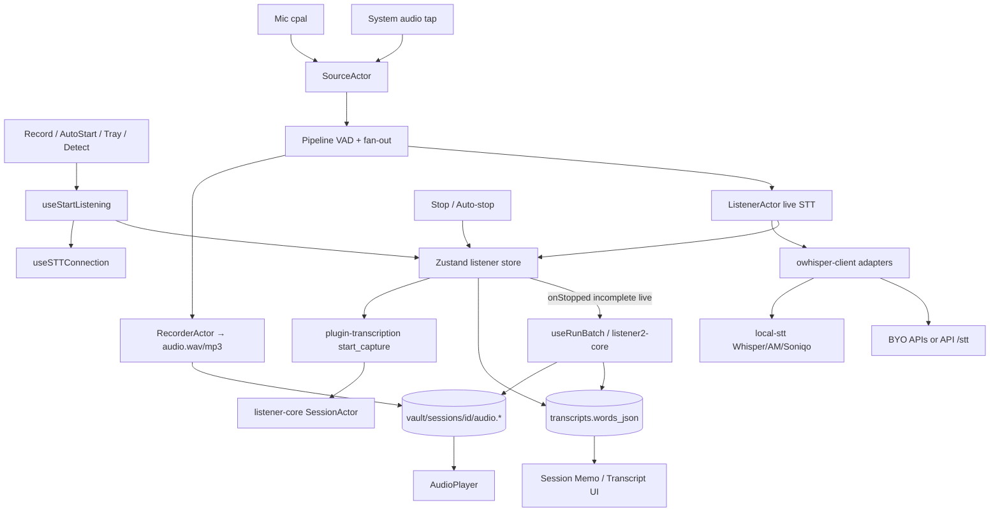

# Product Requirements Document (PRD)

**Product:** Anarlog (this repository; historically Hyprnote; forkable as Meety)  
**License:** MIT  
**Status:** Living reference of *current* product behavior and architecture  
**Last updated:** 2026-07-25  
**Sources:** `README.md`, `AGENTS.md`, `docs/`, `apps/*`, `packages/*`, `plugins/*`, `crates/*`, `supabase/`

This document describes what the app does today and how it is built, so future edits have a shared baseline. It is not a redesign proposal.

---

## 1. Product overview

### 1.1 Positioning

Anarlog is an **open-source, local-first AI meeting notetaker**. It records meetings without joining as a bot (mic + system audio), transcribes (on-device and/or cloud/BYOK), stores canonical data in **local SQLite**, and supports editable memos, AI summaries, transcripts, calendar linkage, contacts, templates, chat, CLI/MCP, and optional cloud features (auth, hosted AI, CloudSync, sharing).

Tagline framing in README: *“Granola, rearranged.”*

### 1.2 Core user loop

1. Open or create a meeting **session** (manual, calendar, tray, or meeting detection).
2. **Record** (start/stop anytime; optional auto-start/stop helpers).
3. Capture **mic + system audio**; write audio under the session vault path.
4. **Transcribe** live and/or batch after stop.
5. Edit **Memo** / review **Transcript** / generate **Summary** (Intelligence / templates).
6. Optionally export (Markdown, PDF, text, Org), chat with the meeting, share, or sync.

### 1.3 Product principles

| Principle | Behavior today |
|-----------|----------------|
| Local-first | Sessions, notes, transcripts live in local SQLite; audio/attachments are local files by default |
| Privacy-first | On-device STT and BYOK LLM keep data off Anarlog servers when configured that way |
| Optional cloud | Auth, hosted STT/LLM, CloudSync, Google/Outlook, sharing are opt-in |
| Sessions as hub | All notes are backed by sessions (`AGENTS.md`) |
| Forkable | MIT; package/crate names still use `@hypr/*` / `hypr-*` historically |

### 1.4 Name / branding history

Hyprnote → brief “char” naming → split: **[char](https://char.com)** is the team’s current commercial productivity app; **this repo** remains the OSS meeting notetaker (anarlog). Docs: https://docs.anarlog.so

---

## 2. Feature requirements (current)

### 2.1 Free / local capabilities

From product docs and `packages/pricing/src/tiers.ts`:

- On-device transcription (supported platforms; Apple Silicon emphasized for local models)
- Save audio recordings + audio player
- Bring-your-own-key STT and LLM (and OpenAI-compatible / Ollama / LM Studio)
- Export (Markdown, PDF, text, Org; memo / summary / transcript combinations)
- Custom default folder / vault location
- In-app chat over meetings
- Contacts view (humans / organizations)
- Calendar view (Apple Calendar without Pro)
- Templates for summaries
- CLI + MCP (read-only against local `app.db`)
- Manual **Record / Stop / Resume** without requiring Zoom/Teams detection
- Import audio (WAV/MP3/…) and SRT/VTT transcripts
- Dictionary / languages for STT
- Floating meeting bar, tray “start meeting”, keyboard shortcuts
- Audio retention policies (`forever` … `none`)

### 2.2 Pro / paid capabilities (JWT entitlements)

Entitlement keys: `hyprnote_pro`, `hyprnote_lite` (Lite counts as paid for many STT/LLM/integration gates; Pro-only for CloudSync / some share / E2EE APIs).

- Hosted (Anarlog) cloud transcription and cloud LLM
- Local ↔ cloud sync (E2EE CloudSync)
- Google Calendar / Outlook Calendar (via Nango + API)
- Shareable links / invites / public slugs (partial DocSend-like features)
- Speaker identification (partial; Pyannote routes)
- Higher rate limits on `/stt` and `/llm`
- Playback rate controls gated Pro in desktop UI
- Trial path (configured in `packages/pricing`; Stripe-backed)

**Meety fork note:** Comp / admin Pro without Stripe is supported via `private.pro_grants` (Supabase auth hook) and client env `VITE_FORCE_PRO` / `VITE_PRO_GRANT_EMAILS`. Stripe remains for charging other users later. Cloud Pro features still require *your* API + Supabase, not upstream Anarlog servers.

### 2.3 Meetings & recording

| Requirement | Current behavior |
|-------------|------------------|
| Freeform record | Header **Record / Stop / Resume**; ⌘⇧N / tray / empty-state start |
| Join & record | When session has meeting URL (Zoom/Meet/Teams/…): open link + start |
| Auto-start scheduled | Setting `auto_start_scheduled_meetings` + calendar countdown |
| Mic detection | Setting `notification_detect`: “Are you in a meeting?” → confirm → auto-start |
| Auto-stop | Setting `auto_stop_meetings` when trigger meeting apps release mic |
| Dual audio | Microphone + system audio (speaker tap) |
| Live + batch STT | Live during capture when model supports it; batch repair on stop if needed |
| Consent / chat | Optional meeting-chat capture and Slack disclosure strings |

### 2.4 Notes surface

Each session exposes:

- **Memo** — user notes (TipTap / ProseMirror via `@hypr/editor`)
- **Summary** — AI-enhanced / template output (`session_documents` kinds)
- **Transcript** — word-level JSON + speaker hints
- Title, participants, tags, action items, attachments
- Enhance / regenerate summary flows (`apps/desktop/src/services/`, chat tools)

### 2.5 Calendar

- **Apple Calendar** — local EventKit (macOS); no cloud account required
- **Google / Outlook** — Pro; OAuth via Nango; events cached in local SQLite
- Used for titles, times, participants, meeting links, notifications, auto-start

### 2.6 AI (Intelligence)

- Providers: Anarlog hosted (Pro), OpenAI, Anthropic, Gemini, OpenRouter, Azure, Mistral, Cloudflare Workers AI, Ollama, LM Studio, custom OpenAI-compatible
- Powers summaries, titles, chat
- Templates + Auto prompt customize summaries (`docs/customize-summaries.mdx`)

### 2.7 Transcription (STT)

- Local: Whisper quantized, AM, Soniqo models via `plugins/local-stt`
- Hosted Anarlog: `{VITE_API_URL}/stt` with JWT (paid rate limits)
- BYO: Deepgram, AssemblyAI, OpenAI, Cartesia, Gladia, Soniox, ElevenLabs, Mistral, Fireworks, Pyannote, Aquavoice, custom, etc. (`settings/ai/stt/shared.tsx`)

### 2.8 Sharing & sync

- Session sharing: private access, link tokens, invites, public slug (`s_…`)
- Web viewers under `/share/*`
- Attachment backups / shared attachments (Pro API)
- CloudSync: E2EE records projection; protocol modes `e2ee_enforced` | `e2ee_only` | `dual`

### 2.9 Integrations (paid API)

- Calendar list/events (Google/Outlook)
- Gmail-style mail routes
- GitHub / Linear tickets
- Nango connection management
- Research search + MCP nest
- Pyannote diarize / identify / voiceprint
- Todos: GitHub + Apple Reminders (desktop settings)

### 2.10 Agent / CLI surfaces

- `anarlog` CLI: list/get/note/transcript/history/export meetings; `doctor`; `mcp`
- MCP tools: `list_meetings`, `get_meeting`, `get_meeting_transcript`, `get_recurring_meeting_history`
- Desktop Settings → Developers → install CLI to `~/.local/bin/anarlog`

### 2.11 Non-goals / out of scope for “core local”

- Replacing the commercial char.com product
- Requiring Supabase to open the desktop app or edit local notes
- Bot joining Zoom/Meet as a participant (product is bot-free capture)

---

## 3. Technical architecture

### 3.1 Monorepo layout

```
apps/
  desktop/     # Primary product — Tauri 2 + React (Vite)
  web/         # Marketing, auth/billing UI, share viewers, admin APIs
  api/         # Axum backend (proxies, sync, billing, integrations)
  cli/         # anarlog CLI + MCP
  stripe/      # Stripe ↔ Supabase sync worker
packages/      # Shared TS (@hypr/db, editor, ui, supabase, pricing, …)
plugins/       # Tauri plugins (Rust + JS bindings)
crates/        # Rust domain (db-app, audio, STT, sync, API modules, …)
supabase/      # Cloud Postgres migrations + RLS tests
docs/          # User docs (Mintlify → docs.anarlog.so)
legacy/        # Importers / legacy parsers
```

**Workspaces:** `pnpm-workspace.yaml` (`apps/*`, `packages/*`, `plugins/*`, …); Cargo workspace in root `Cargo.toml` (`apps/api`, `apps/cli`, `apps/desktop/src-tauri`, `crates/*`, `plugins/*`).

**Tooling:** Node ≥ 22, pnpm, Turbo, dprint/oxfmt, Rust toolchain (`rust-toolchain.toml`), Taskfile for Supabase helpers.

### 3.2 High-level system diagram

```text
┌─────────────────────────────────────────────────────────────────┐
│ Desktop (Tauri + React)                                         │
│  UI: sessions, STT, calendar, settings, chat, sharing           │
│  State: Zustand tabs/listener · TanStack Query · TipTap editor  │
└───────────────┬─────────────────────────────┬───────────────────┘
                │                             │
                ▼                             ▼ optional HTTPS
     Local SQLite (app.db)              apps/api (Axum)
     + vault files (audio, …)             ├── /stt /llm
     via plugins/db + crates/db-app       ├── /sync (E2EE, shares)
                                          ├── /subscription|/billing|/rpc
                                          ├── /calendar /mail /ticket /nango
                                          └── research / pyannote / support
                │                             │
                │                             ▼
                │                      Supabase Auth + Postgres
                │                      Stripe · Nango · SQLite Cloud
                ▼
     CLI / MCP (read-only same DB)

Web: marketing · account/checkout · share viewers · ops admin APIs
```

### 3.3 Desktop stack

| Layer | Choice |
|-------|--------|
| Shell | Tauri 2 (`apps/desktop/src-tauri`) |
| UI | React 19, Vite, TanStack Router / Query / Form |
| Editor | `@hypr/editor` (ProseMirror); styles in `@hypr/tiptap` |
| Styling | Tailwind + `@hypr/ui`; `cn` from `@hypr/utils`; `motion/react` |
| i18n | Lingui |
| DB access | Drizzle schema mirror (`packages/db`) + `useDrizzleLiveQuery` (`packages/db-react`) over `@hypr/plugin-db` |
| Schema SoT | Rust SQL migrations in `crates/db-app/migrations/` |

### 3.4 Data stores

| Store | Role |
|-------|------|
| **SQLite `app.db`** | Canonical durable domain (sessions, documents, transcripts, …) |
| **Vault filesystem** | `sessions/{id}/audio.{mp3,wav,ogg}`, attachments |
| **Tantivy** | Full-text search index (`plugins/tantivy` + dirty-queue migrations) |
| **Zustand** | Ephemeral UI: tabs, live listener/transcript |
| **Supabase Postgres** | Auth users, profiles, Stripe mirrors, share metadata, RLS |
| **SQLite Cloud** | CloudSync encrypted replica (via API token exchange) |
| **TinyBase** | Legacy only; not active runtime SoT |

### 3.5 Local-first vs cloud split

| Local (default) | Cloud / networked |
|-----------------|-------------------|
| SQLite + vault files | Supabase Auth + JWT claims |
| On-device STT / local LLM / BYOK | Hosted `/stt`, `/llm` |
| Apple Calendar | Google/Outlook via Nango |
| Offline edit + local models if preconfigured | CloudSync, share links, attachment backups |

Desktop constructs `supabase: null` when `VITE_SUPABASE_URL` / `VITE_SUPABASE_ANON_KEY` are absent (`apps/desktop/src/auth/client.ts`).

---

## 4. Domain model

**Rule:** Sessions are the core entity; notes/transcripts/attachments hang off sessions.

Canonical migration: `crates/db-app/migrations/20260710223922_canonical_data_model.sql`.

| Table | Purpose |
|-------|---------|
| `sessions` | Meeting/note container (`kind` default `meeting`, event linkage, folder, slug, status, times) |
| `session_documents` | Rich docs: `note`, `summary`, `template_output`, legacy kinds |
| `transcripts` | `words_json`, `speaker_hints_json`, provider/model, audio link |
| `session_participants` | Attendees → `humans` |
| `session_attachments` | Recordings and files (`source_type` includes `session_audio`) |
| `action_items` | Todos from meetings |
| `humans` / `organizations` | Contacts CRM-lite |
| `tags` / `session_tags` | Labeling |
| `entity_mentions` | Cross-entity refs |
| `chat_groups` / `chat_messages` | In-app AI chat |
| `daily_notes` | Non-meeting daily notes |
| `templates` | Summary templates |
| `calendars` / `events` | Local calendar cache |
| `workspaces` / `workspace_memberships` | Multi-device / CloudSync tenancy |
| `app_settings` | Key/value JSON settings |

**E2EE domain tables** (encrypted sync projection): `sessions`, `session_documents`, `transcripts`, `session_participants`, `session_attachments`, `action_items`, `humans`, `organizations` (`crates/db-app/src/e2ee.rs`).

**CloudSync registry:** many tables listed in `crates/db-app/src/cloudsync.rs`; direct enabled sync is centered on `e2ee_records` with plaintext domain tables projected through E2EE.

Supporting tables (later migrations): E2EE local state/dirty/witness, share caches, attachment transfer jobs, search index dirty/state, etc.

---

## 5. Data flow

### 5.1 Session / note read-write path

```text
UI component
  → useDrizzleLiveQuery / mutations (@hypr/db-react + Drizzle)
  → @hypr/plugin-db execute/subscribe
  → crates/db-* + migrations (db-app)
  → app.db
```

Schema ownership stays on the Rust migration side; TypeScript schema is a typed mirror (`packages/db/AGENTS.md`).

### 5.2 Audio & transcription pipeline



**Narrative:**

1. Start binds to `session_id`, acquires capture lifecycle/CloudSync lease as needed, resolves STT connection.
2. Rust opens **mic + speaker** (`crates/audio-actual`), records under `sessions/{id}/`, optionally streams live STT.
3. Live deltas update Zustand (captions/UI) and SQLite `transcripts`.
4. On stop, finalize `audio.mp3`. If live was incomplete/unavailable → **batch STT** then enhance; else enhance-only.
5. Retention policy may delete audio after transcript is processed (`audio_retention` / `save_recordings`).

**Key paths:**

- UI orchestration: `apps/desktop/src/stt/useStartListening.ts`, `useRunBatch.ts`, `useSTTConnection.ts`, `contexts.tsx`
- Plugin: `plugins/transcription`, `plugins/local-stt`, `plugins/detect`, `plugins/fs-sync`
- Rust: `crates/listener-core`, `crates/listener2-core`, `crates/audio-actual`, `crates/owhisper-client`, `crates/detect`

### 5.3 Auth & billing claim flow

```text
Stripe entitlements → stripe.active_entitlements
  → public.custom_access_token_hook
       (+ private.pro_grants email allowlist)
  → JWT claims: entitlements, subscription_status, trial_end, …
  → Desktop deriveBillingInfo / API Claims::is_pro|is_paid
  → UI gates + API middleware + Supabase RLS
```

### 5.4 CloudSync (simplified)

```text
Desktop enable Sync (Pro)
  → POST /sync/token
  → SQLite Cloud credentials
  → plugins/db CloudSync + E2EE encrypt/decrypt domain rows
  → e2ee_records / witness APIs
```

---

## 6. Desktop component & module structure

### 6.1 Routes (`apps/desktop/src/routes/`)

| Path | Role |
|------|------|
| `/app` | Shell; listener store |
| `/app/main` | Main window layout (tabs live here) |
| `/app/note/$sessionId` | Session deep link |
| `/app/onboarding` | First-run wizard |
| `/app/composer` | Composer surface |
| `/app/instruction` | Deep-link / integration handoff |

Most UX is **tab-based** inside the main shell (`store/zustand/tabs`), not many file routes.

### 6.2 Tab types

`sessions`, `shared_sessions`, `shared_note_preview`, `contacts`, `templates`, `humans`, `organizations`, `empty`, `calendar`, `changelog`, `settings`, `onboarding`, `edit`, `task`, `daily_summary`

### 6.3 Major modules under `apps/desktop/src/`

| Module | Responsibility |
|--------|----------------|
| `session/` | Meeting note UI: header, memo, summary, transcript, export, enhance |
| `stt/` | Listening lifecycle, connections, batch, recovery, keywords |
| `chat/` | AI chat panel, tools, MCP-related surfaces |
| `sidebar/` | Timeline, nav to calendar/contacts/templates/settings/shared |
| `calendar/` | Calendar views + queries |
| `contacts/` | Humans / orgs |
| `templates/` | Summary templates editor |
| `settings/` | App, account, sync, notifications, permissions, AI STT/LLM, dictionary, todo, developers |
| `onboarding/` | Permissions, login, calendar, final, welcome note |
| `auth/` | Supabase client, billing provider, CloudSync preference, deeplink |
| `billing/` | Trial dialogs |
| `session-sharing/` | Share create/sync/comments/attachments |
| `shared-notes/` | Inbound shared note preview / handoff |
| `attachment-sync/` | Cloud attachment transfer lifecycle |
| `audio-player/` | WaveSurfer playback |
| `meeting-float/` | Compact bar while listening |
| `ai/` | LLM connection helpers |
| `search/` | Search UI |
| `services/` | Event listeners, enhancer, audio retention |
| `task/` | GitHub issue/PR tabs |
| `db/` | Desktop DB wiring |
| `store/zustand/` | Tabs, listener, transcript, … |
| `editor-bridge/` | App ↔ editor bridge |

### 6.4 Settings sections

`app` (general/meetings/telemetry/storage), `account`, `sync`, `notifications`, `permissions`, `developers`, `dictionary`, `transcription`, `intelligence`, `todo` (+ nav opens Calendar / Contacts / Templates).

### 6.5 Onboarding (macOS)

`permissions` → `login` → `calendar` → `final` (other platforms skip permissions step as configured).

### 6.6 Editor packages

- `packages/editor` — ProseMirror note editor, plugins (autolink, clipboard, comments, hashtags, tasks, search, …)
- `packages/tiptap` — shared editor CSS
- `packages/ui`, `packages/utils` — shared UI / `cn`

### 6.7 Tauri plugins (registered in `apps/desktop/src-tauri/src/lib.rs`)

Notable: `db` (+ CloudSync), `auth`, `calendar`, `transcription`, `local-stt`, `local-llm`, `detect`, `tray`, `windows`, `fs-sync`, `fs2`, `tantivy`, `export`, `importer`, `template`, `attachment-sync`, `mcp`, `agent`, `updater2`, `analytics`, `notification`, `shortcut`, `dictation`, `permissions`, `settings`, `overlay`, `opener2`, `deeplink2`, …

Capabilities: `apps/desktop/src-tauri/capabilities/default.json` (broad plugin defaults; HTTP allow includes `https://**` / `http://**`).

---

## 7. Web app structure

**Stack:** TanStack Start / Vite (`apps/web`).

### 7.1 User-facing routes

| Route | Feature |
|-------|---------|
| `/` | Marketing / manifesto / pricing |
| `/auth`, `/confirm-auth`, `/reset-password`, `/update-password` | Auth |
| `/_view/app/*` | Account, checkout, portal, switch-plan, integrations |
| `/_view/callback/*` | Auth / billing / integration / signout callbacks |
| `/_view/download/*` | Platform downloads |
| `/share/$shareId` | Authenticated share viewer |
| `/share/link/$shareId` | Capability-token share |
| `/share/invite/$invitationId` | Invitation accept |
| `/share/public/$publicSlug` | Public share |
| `/blog`, `/changelog`, `/privacy`, `/terms`, `/discord` | Content / legal |

### 7.2 Web API routes (`apps/web/src/routes/api/`)

Mostly marketing/ops: admin CMS/kanban/media/stars, OG images, templates, Slack interactive webhooks, assets — not the core meeting editor.

---

## 8. API endpoints (`apps/api`)

**Framework:** Axum  
**Auth:** Supabase JWT Bearer (`crates/api-auth`)  
**Composition:** `apps/api/src/main.rs`  
**Paid entitlements:** `hyprnote_pro` \| `hyprnote_lite`  
**Pro-only:** `hyprnote_pro` for CloudSync token, E2EE witness, attachment backups, share snapshot publish, etc.

### 8.1 Infra

| Method | Path | Auth |
|--------|------|------|
| GET | `/health` | none |
| GET | `/openapi.json` | none |

### 8.2 STT (`crates/transcribe-proxy`)

Auth: JWT · Rate limit: paid vs free tiers

| Method | Path |
|--------|------|
| GET/POST | `/listen`, `/stt/`, `/stt/listen` |
| GET | `/stt/status/{pipeline_id}` |
| POST | `/stt/callback/{provider}/{id}` (webhook, no JWT) |

### 8.3 LLM (`crates/llm-proxy`)

| Method | Path |
|--------|------|
| POST | `/chat/completions` |
| POST | `/llm/`, `/llm/chat/completions` |

### 8.4 Subscription (mounted at `/subscription`, `/rpc`, `/billing`)

| Method | Path |
|--------|------|
| GET | `…/can-start-trial` |
| POST | `…/start-trial` |
| DELETE | `…/delete-account` |

### 8.5 Sync / CloudSync (`/sync`, Pro unless noted)

| Method | Path | Notes |
|--------|------|-------|
| POST | `/sync/token` | CloudSync credentials |
| PUT | `/sync/e2ee/identity` | Recovery key claim |
| POST/PUT/GET | `/sync/attachment-backups/*` | reserve, upload-grant, finalize, head, download, delete |
| PUT | `/sync/shares/{share_id}/snapshot` | Publish share |
| POST | `/sync/shares/{share_id}/attachments/*` | Shared attachment pipeline |
| GET/POST | `/sync/e2ee/witness/{workspace_id}` | Witness |
| PUT | `/sync/shares/{share_id}/web-edit` | JWT only (not Pro middleware) |

### 8.6 Shared notes (root paths)

**Public (IP rate limit):**  
`GET /shared-notes/public/{slug}`, `POST /shared-notes/link/{share_id}`, handoff + attachment download variants, `POST /shared-notes/handoffs/claim`, …

**Authenticated:**  
`POST /shared-notes/invitations/{invitation_id}/email`,  
`POST /shared-notes/access/{share_id}/attachments/{attachment_id}/download`

### 8.7 Paid integrations (`hyprnote_pro` \| `hyprnote_lite`)

- `POST /calendar/google|outlook/list-calendars|list-events`
- `POST /mail/google/*` (labels, messages, threads, …)
- `POST /ticket/github|linear/*`
- `POST /nango/session`
- `POST /research/search` (+ `/research/mcp`)
- `POST /pyannote/v1/diarize|identify|voiceprint`

### 8.8 Nango management (JWT only)

`GET|DELETE /nango/connections`, `GET /nango/whoami`  
Webhook: `POST /nango/webhook` (no JWT)

### 8.9 Support (optional JWT)

`POST /feedback/submit`, Chatwoot nests under `/support/chatwoot/*`, `/support/mcp`

### 8.10 Crates not currently mounted in `main.rs`

`api-storage`, `api-messenger`, `api-bot`, `api-claw`, `api-agent` exist under `crates/` but are not wired into the live API router today.

---

## 9. CLI & MCP

```text
anarlog [--base DIR] [--db-path FILE] [--json] <command>
```

Env: `ANARLOG_BASE`, `ANARLOG_DB_PATH`.

| Command | Behavior |
|---------|----------|
| `meetings list\|get\|note\|transcript\|history\|export` | Read/export local meetings |
| `doctor` | DB path + schema readiness |
| `mcp` | Read-only MCP over stdio |

Resources: `anarlog://meetings/{id}`, `…/transcript`, `anarlog://series/{series_id}`.

Docs: `docs/reference/cli.mdx`, `docs/reference/mcp.mdx`.

---

## 10. Configuration & environment

### 10.1 Desktop (`apps/desktop/src/env.ts`)

| Variable | Purpose |
|----------|---------|
| `VITE_APP_URL` | Web app URL (default `http://localhost:3000`) |
| `VITE_API_URL` | API base (default `http://localhost:3001`) |
| `VITE_SUPABASE_URL` / `VITE_SUPABASE_ANON_KEY` | Enable auth client |
| `VITE_PRO_PRODUCT_ID` | Billing product id |
| `VITE_FORCE_PRO` | Client-side unlock all Pro UI |
| `VITE_PRO_GRANT_EMAILS` | Comma-separated emails unlocked client-side |
| `VITE_SENTRY_DSN`, `VITE_POSTHOG_*` | Telemetry (optional) |
| `VITE_APP_VERSION` | Version string |

### 10.2 API / sync (selected)

`SUPABASE_*`, `STRIPE_*`, `NANGO_*`, LLM/STT proxy keys, `SQLITECLOUD_*`, `ANARLOG_CLOUDSYNC_*`, `POSTHOG_API_KEY`, `SENTRY_DSN`, Loops/Exa/Jina/Pyannote as configured in `apps/api` + `crates/api-env` / `api-sync`.

### 10.3 Local commands (from `AGENTS.md`)

```bash
pnpm install
pnpm -F @hypr/desktop tauri:dev
pnpm -F @hypr/web dev
cargo run -p api          # needs full env
task supabase-start       # optional local Supabase
pnpm exec dprint fmt
pnpm -F desktop typecheck
cargo check
```

---

## 11. Packages of record

| Package | Purpose |
|---------|---------|
| `@hypr/db` | Drizzle schema + DB proxy |
| `@hypr/db-react` | Reactive live-query hooks |
| `@hypr/db-tauri` / `db-runtime` | Transport contracts |
| `@hypr/editor` | Note editor |
| `@hypr/tiptap` | Editor CSS |
| `@hypr/ui` / `@hypr/utils` | UI + helpers |
| `@hypr/supabase` | Client, JWT, `deriveBillingInfo`, Pro grant helpers |
| `@hypr/pricing` | Plan tiers / trial policy |
| `@hypr/api-client` | Generated OpenAPI client |
| `@hypr/store` | Settings Zod schema |
| `@hypr/changelog` | Changelog content |
| `@hypr/plugin-sdk` | Plugin TS SDK |
| `@hypr/agent-*` | Agent runtimes |

---

## 12. Privacy, telemetry, and trust boundaries

Meety fork P0 posture (2026-07-25):

- PostHog analytics **opt-in** (`telemetry_consent` default `false`; analytics plugin disabled until consent)
- Sentry: JS only after consent + `VITE_SENTRY_DSN`; Rust requires `ENABLE_SENTRY=true` + `SENTRY_DSN`
- Stable auto-updater **disabled** (no `desktop2.hyprnote.com`)
- Whisper / common GGUF models download from Hugging Face (not hyprnote S3)
- Argmax/AM packs and HyprLLM downloads disabled unless `MEETY_AM_*_URL` / `MEETY_HYPR_LLM_URL` set
- Resource suggestions do not call `anarlog.so` unless `VITE_RESOURCE_SUGGESTIONS_URL` is set
- Web prod `VITE_API_URL` has no upstream default (`api.char.com` removed)

Still intentional when the user opts in / configures cloud:

- Cloud STT/LLM/CloudSync/share when enabled and authenticated
- BYOK provider APIs the user configures

Hardening notes for forks: broad Tauri HTTP capability, unscoped `write_text_file` in `plugins/fs2`, Deno `eval` plugin exposure if renderer compromised.

---

## 13. User-facing documentation map

Published at https://docs.anarlog.so — sources under `docs/`:

| Doc | Topic |
|-----|-------|
| `index.mdx` / `quickstart.mdx` | Overview + first meeting |
| `meetings.mdx` | Record / join / stop / resume |
| `automatic-capture.mdx` | Auto-start, detect, auto-stop, floating bar |
| `import-recordings.mdx` | Audio + SRT/VTT import |
| `notes.mdx` | Memo / Summary / Transcript / export |
| `customize-summaries.mdx` | Templates + prompts |
| `calendar.mdx` | Apple / Google / Outlook |
| `ai-setup.mdx` | STT vs Intelligence providers |
| `offline.mdx` / `data-and-privacy.mdx` | Local/offline & privacy |
| `reference/cli.mdx` / `mcp.mdx` | Machine interfaces |
| `agents/*` | Agent workflows |

---

## 14. Acceptance criteria (for regressions)

Use these as “current product still works” checks when editing:

1. **Local session CRUD** works with no Supabase env (create note, edit memo, persist across restart).
2. **Manual Record → Stop** produces audio under session vault and a transcript (local or configured STT).
3. **Meeting detection is optional** — recording does not require Zoom/Teams.
4. **Batch repair** runs when live STT fails but audio exists.
5. **Apple Calendar** works without Pro; Google/Outlook require paid JWT + Nango.
6. **Free user** cannot call Pro-only `/sync/token` without entitlement (or `pro_grants` / Stripe).
7. **Admin grant path:** email in `private.pro_grants` or `VITE_FORCE_PRO` unlocks Pro UI; JWT grant required for API Pro routes.
8. **CLI** `anarlog meetings list` reads the same `app.db` as the desktop app.
9. **Export** produces Markdown/PDF from memo/summary/transcript as configured.
10. **Schema changes** go through `crates/db-app/migrations/` + Drizzle mirror — never hand-edit production DB files.

---

## 15. Future edit guidance

When changing the product:

1. Update this `PRD.md` if behavior, architecture, APIs, or domain tables change materially.
2. Prefer local-first paths that degrade gracefully without cloud.
3. Keep schema SoT in Rust migrations; TS consumes `execute`/`subscribe` only.
4. Feature-gate paid cloud on JWT claims (not client-only flags) when API/RLS are involved.
5. For Meety branding/fork work: rename surfaces (`@hypr/*`, bundle IDs, deep links, updater/CDN, telemetry) deliberately; do not silently keep upstream phone-home endpoints in production builds.

---

## Appendix A — Important absolute paths

| Concern | Path |
|---------|------|
| Desktop entry | `apps/desktop/src/main.tsx` |
| Desktop DB | `apps/desktop/src/db/index.ts` |
| Schema migrations | `crates/db-app/migrations/` |
| Drizzle mirror | `packages/db/src/schema.ts` |
| API router | `apps/api/src/main.rs` |
| Auth hook / Pro grants | `supabase/migrations/*auth*`, `*pro_grants*` |
| Billing derive | `packages/supabase/src/billing.ts` |
| Pricing tiers | `packages/pricing/src/tiers.ts` |
| Capture start | `apps/desktop/src/stt/useStartListening.ts` |
| Listener core | `crates/listener-core/` |
| Audio capture | `crates/audio-actual/` |
| Agent guidelines | `AGENTS.md` |

---

*End of PRD — current-state reference for Anarlog / Meety fork development.*
